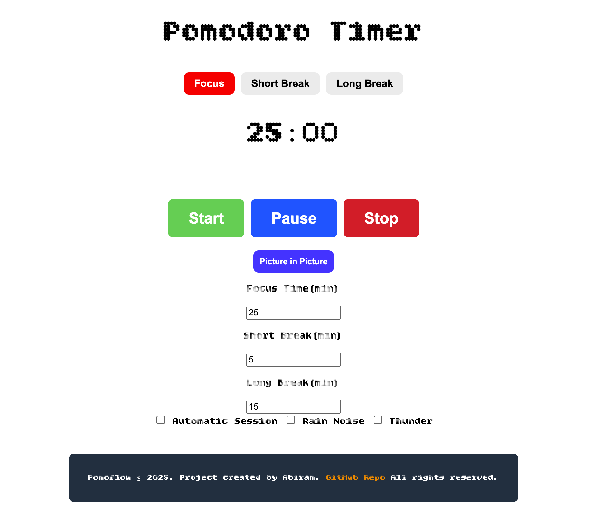
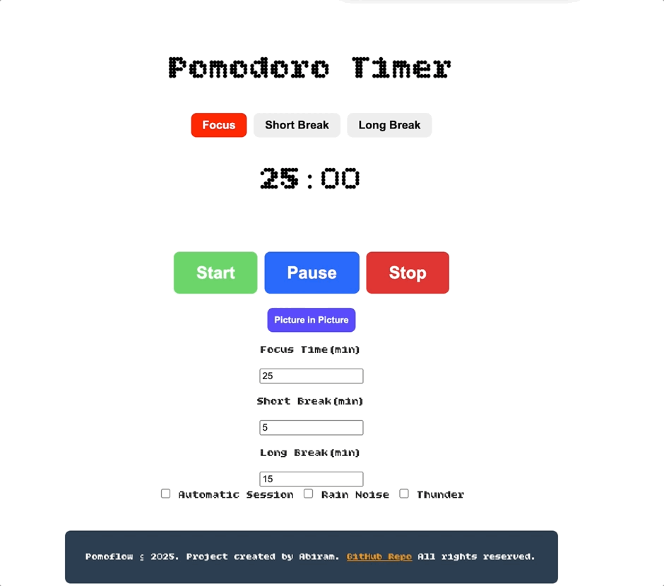

# Pomoflow - A Modern Web-Based Pomodoro Timer with Picture-in-Picture 📊⏱️

[](https://github.com/abiramdevops/Pomoflow/blob/main/LICENSE)
[](https://github.com/abiramdevops/Pomoflow/issues)
[](https://github.com/abiramdevops/Pomoflow/network)
[](https://github.com/abiramdevops/Pomoflow/stargazers)
[](https://abiramdevops.github.io/Pomoflow/)

Pomoflow is a sleek, web-based **Pomodoro Technique timer** application built with pure **HTML, CSS, and JavaScript**. It's designed to boost your productivity by managing focus sessions and breaks efficiently. The standout feature is its **experimental Picture-in-Picture (PiP) mode**, allowing you to keep an always-on-top timer window while working on other tasks—a game-changer for workflow integration.

**➡️ [Live Demo: Try it here!](https://abiramdevops.github.io/Pomoflow/)**

<!--  -->


---

## ✨ Why Pomoflow? What Makes It Unique?

While there are many Pomodoro timers, Pomoflow stands out with:
*   **Picture-in-Picture (PiP) Support:** Uniquely leverages the experimental Document Picture-in-Picture API to create a custom, always-visible timer window. This is perfect for multitaskers who need to keep track of time without switching tabs or windows.
*   **Immersive White Noise:** Built-in rain and thunder sounds to create a focused auditory environment.
*   **Pure Web Tech:** No frameworks, no bloat. Just vanilla JS for a fast and lightweight experience.
*   **Fully Responsive:** Works seamlessly on desktop, tablet, and mobile devices.

---

## 🚀 Features

- **⏰ Classic Pomodoro Technique:** 25-minute focus sessions, 5-minute short breaks, and a 15-minute long break after every 4 cycles.
- **🎨 Custom PiP Window:** A beautifully rendered Canvas-based timer that appears in a floating PiP window.
- **🔊 Ambient White Noise:** Toggleable rain and thunder sounds for better concentration.
- **🔄 Auto Cycle Progression:** Option to automatically move to the next session (focus/break) without manual intervention.
- **⏯️ Full Controls:** Start, Pause, and Stop functionality with a clear visual countdown.
- **📱 Responsive Design:** Adapts beautifully to any screen size.

---

## 🛠️ How to Use / Installation

Getting started with Pomoflow is incredibly easy.

1.  **Use the Live Demo** (Recommended):
    Simply visit the **[Live Demo Page](https://abiramdevops.github.io/Pomoflow/)** and start using it immediately.

2.  **Run it Locally:**
    ```bash
    # Clone the repository
    git clone https://github.com/abiramdevops/Pomoflow.git

    # Navigate into the project directory
    cd Pomoflow

    # Open 'index.html' in your modern browser (Chrome, Edge, Firefox recommended)
    # No server needed! Just open the file.
    ```

**Using PiP Mode:**
1.  Click the "Enter PiP Mode" button.
2.  A floating, draggable timer window will appear.
3.  You can now work in any other application while Pomoflow stays on top.
4.  To exit, click the "Exit PiP Mode" button in the main browser tab.

---

## 🧪 Technology Stack

- **Frontend:** Vanilla HTML5, CSS3, JavaScript (ES6+)
- **PiP API:** Experimental Document Picture-in-Picture API
- **Graphics:** HTML5 Canvas for custom PiP rendering
- **Audio:** Web Audio API

---

## 📜 License

This project is licensed under the **Creative Commons Attribution-NonCommercial-ShareAlike 4.0 International (CC BY-NC-SA 4.0)**.

*   **✅ You are free to:**
    *   **Share** — copy and redistribute the material in any medium or format.
    *   **Adapt** — remix, transform, and build upon the material.
*   **❌ Under the following terms:**
    *   **Attribution** — You must give appropriate credit, provide a link to the license, and indicate if changes were made.
    *   **NonCommercial** — You may not use the material for commercial purposes.
    *   **ShareAlike** — If you remix, transform, or build upon the material, you must distribute your contributions under the same license as the original.

For commercial use or licensing inquiries, please contact **Abiram** at `satkunaseelan.abiram@proton.me`.

---

## 🤝 Contributing & Feedback

Contributions, issues, and feature requests are welcome! Feel free to check the [issues page](https://github.com/abiramdevops/Pomoflow/issues).

1.  Fork the Project
2.  Create your Feature Branch (`git checkout -b feature/AmazingFeature`)
3.  Commit your Changes (`git commit -m 'Add some AmazingFeature'`)
4.  Push to the Branch (`git push origin feature/AmazingFeature`)
5.  Open a Pull Request

---

## 👨‍💻 Credits

Developed with ❤️ by **[Abiram](https://github.com/abiramdevops)**.